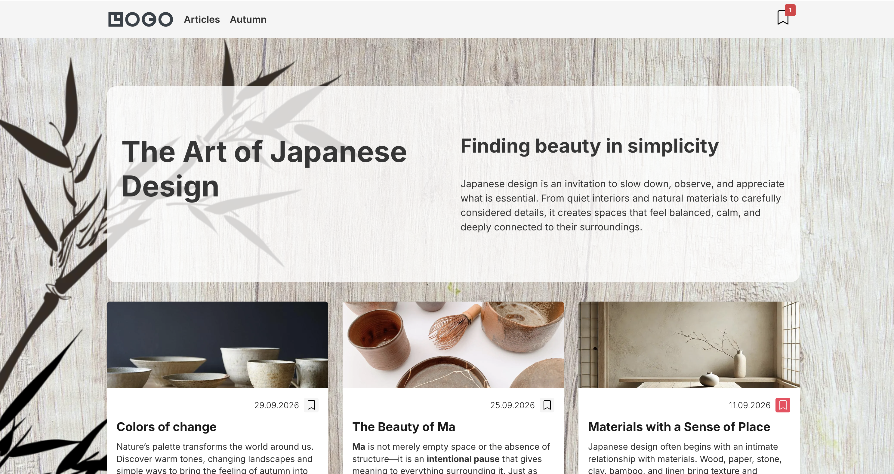

# Wudo Drupal starter

Drupal 11 starter project containing the site dependencies, custom theme,
custom module, and project recipes in one repository. The project uses
`web/` as its document root.



## Repository layout

- `web/` is the Drupal document root.
- `web/themes/custom/wudo/` contains the custom theme and its component source.
- `web/modules/custom/wudo_theme_extension/` contains custom Drupal behavior and API endpoints.
- `recipes/` contains the content recipes applied during installation.
- `config/sync/` contains exported Drupal configuration tracked in Git.
- `vendor/` and frontend dependencies are generated locally and are not committed.

Contributed extensions are managed by Composer. Custom extensions and recipes
are committed directly in this repository.

## Quick start

Requires [DDEV](https://ddev.com). Everything else, including Composer and
Node.js, runs inside the containers.

```bash
git clone git@github.com:wunderio/wudo_starter.git && cd wudo_starter
ddev start
ddev site-install
```

`ddev site-install` installs the Composer and npm dependencies, builds the
theme, installs Drupal from the configuration in `config/sync/`, creates the
home page and the error pages, builds the XML sitemap and prints a one-time
login link. Add `--demo` to install the demo
content (articles, a gallery and landing pages) instead of the bare home page:

```bash
ddev site-install --demo
```

Running the command on an existing site reinstalls it; Drush asks before
dropping the database.

## Installing without DDEV

Create `web/sites/default/settings.local.php` with the database connection
(see `web/sites/example.settings.local.php`), set the `DRUPAL_HASH_SALT`
environment variable, then run from the project root:

```bash
composer install
(cd web/themes/custom/wudo && npm ci && npm run build)
vendor/bin/drush site:install --existing-config
vendor/bin/drush recipe ../recipes/error_pages
vendor/bin/drush recipe ../recipes/base_content
vendor/bin/drush xmlsitemap:rebuild
```

Use `../recipes/demo` in place of `../recipes/base_content` for the demo
content.

## Configuration

`config/sync/` is the single source of truth for site configuration, and the
site is installed from it. Export after making intentional changes and import
when deploying:

```bash
ddev drush config:export
ddev drush config:import
```

## Content recipes

- `recipes/error_pages` holds the "Page not found" and "Access denied" pages
  and is always applied.
- `recipes/base_content` holds the home page. The front page setting points to
  its `/home` alias.
- `recipes/demo` holds the demo content, including its own `/home` page.

Apply only one of the last two to a site. To update a recipe from a running site,
export the entities with their dependencies:

```bash
ddev drush content:export node --with-dependencies --dir=../recipes/demo/content
ddev drush content:export menu_link_content --dir=../recipes/demo/content
```

The `wudo_theme_extension` module makes paragraphs and hand-set URL aliases
part of the export; paragraphs are written inline in the entity that owns them.

## Adding a language

The starter ships with one language, English. To make the site multilingual,
run one command with the code of the language to add:

```bash
ddev add-language lv
```

It can be run again for every further language. The command:

- installs Content Translation and Configuration Translation;
- adds the language and downloads its interface translations;
- makes content, media, taxonomy terms, menu links, blocks and paragraphs
  translatable;
- places the language switcher in the header;
- makes the front page and error page aliases work in every language;
- adds an XML sitemap per language (`/lv/sitemap.xml`);
- exports the configuration, so the language is part of every later install.
  Review and commit the changes in `config/sync`.

URLs get a language prefix (`/en/...`, `/lv/...`) and `/` redirects to the
default language. Content stays in English until it is translated: an
untranslated page is not listed in the other language and its alias only
works under `/en`.

Without DDEV, run the steps yourself:

```bash
drush pm:install content_translation config_translation
drush language:add lv
drush wudo:multilingual
drush xmlsitemap:rebuild
drush config:export
```

## Settings and secrets

`web/sites/default/settings.php` is tracked in Git and contains no credentials.
Database connections, API keys and other environment-specific values belong in
`settings.local.php`, which is ignored, or in environment variables. Never
commit credentials or production secrets.

The DDEV-generated `settings.ddev.php` is local-only. Its permissive
`trusted_host_patterns` setting is suitable for local development only; set
explicit host patterns before deploying to a shared or production environment.

## SEO and security defaults

- `metatag` provides titles, descriptions, canonical URLs and Open Graph tags.
- `xmlsitemap` serves `/sitemap.xml` for all three content types; the error
  pages and the front page node are left out.
- `redirect` keeps old URLs working when aliases change.
- `csp` enforces a Content Security Policy that allows scripts from the site
  itself only. Inline scripts and inline event handlers (`onclick="…"`) are
  blocked, so attach behavior from JavaScript files. Embeds are allowed from
  YouTube and Vimeo; add other sources at `/admin/config/system/csp`.
- `seckit` sends `Strict-Transport-Security` and `Referrer-Policy`.

## Quality checks

The same checks run in GitHub Actions (`.github/workflows/ci.yml`) on every
pull request, together with a full `ddev site-install --demo` from scratch.

```bash
ddev exec vendor/bin/phpcs      # Drupal coding standards
ddev exec vendor/bin/phpstan    # static analysis
ddev exec vendor/bin/phpunit    # tests, on a throwaway SQLite database
ddev npm run lint:css           # run in web/themes/custom/wudo
ddev e2e                        # browser tests against the installed site
```

`ddev e2e` runs the Playwright tests in `tests/e2e` inside the web container;
the first run downloads Chromium. They cover every page in the XML sitemap:

- smoke checks: status codes, one `h1`, no JavaScript or CSP errors;
- interactions: favorites drawer, favorites via `/api/favorites`, mobile menu;
- accessibility: axe-core, WCAG 2.2 AA, on desktop and mobile viewports;
- Lighthouse: accessibility, best practices and SEO must score 100.

Arguments are passed to Playwright, e.g. `ddev e2e a11y --project=desktop`.
The HTML report, with Lighthouse reports attached, is written to
`tests/e2e/playwright-report`. Tests that need articles are skipped unless
the site was installed with `--demo`.

`vendor/bin/phpcbf` and `npm run lint:css -- --fix` fix most style issues
automatically.

## Component catalog

```bash
ddev storybook
```

builds a Storybook catalog of the theme's Single Directory Components and
prints its address. Every page is generated from the component's
`*.component.yml` and rendered with its own Twig template, CSS and JS, so a
new component shows up without writing a story. See
`web/themes/custom/wudo/docs/storybook.md`.

## Theme development

Run these commands from `web/themes/custom/wudo`:

```bash
npm run dev
npm run dev:sdc
```

Build production assets with `npm run build`. `node_modules/`, `dist/` and the
`.css` files compiled next to each component's `.scss` are ignored by Git and
recreated by the build, so run it after changing any `.scss` file.

### Twig template suggestions

Enable Drupal's local theme development mode to show Twig template filenames
and suggestions as HTML comments in the page source:

```bash
ddev drush theme:dev on
ddev drush cr
```

Open the page source in the browser and look for comments such as
`THEME DEBUG` and `THEME HOOK SUGGESTIONS`. Disable it before production:

```bash
ddev drush theme:dev off
ddev drush cr
```
